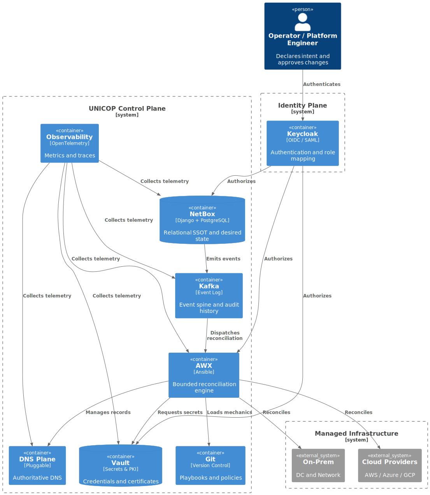

# UNICOP — Unified Infrastructure Control Plane

*A control-plane architecture for long-lived, multi-actor, hybrid and multi-cloud infrastructure.*

---

## Table of Contents
- [What problem exists that Terraform, Pulumi, Crossplane fundamentally cannot solve?](#what-problem-exists-that-terraform-pulumi-crossplane-fundamentally-cannot-solve)
- [The reality UNICOP assumes (not ideals)](#the-reality-unicop-assumes-not-ideals)
- [What UNICOP is](#what-unicop-is)
- [What UNICOP explicitly is not](#what-unicop-explicitly-is-not)
- [High-level architecture](#high-level-architecture)
- [The core distinction: relational truth + bounded reconciliation](#the-core-distinction-relational-truth--bounded-reconciliation)
- [What UNICOP deliberately does not model](#what-unicop-deliberately-does-not-model)
- [Where IaC-centric systems hit a ceiling (by design)](#where-iac-centric-systems-hit-a-ceiling-by-design)
- [Competitors and adjacent approaches (and why UNICOP emerged)](#competitors-and-adjacent-approaches-and-why-unicop-emerged)
- [Failure modes (acknowledged explicitly)](#failure-modes-acknowledged-explicitly)
- [Project structure](#project-structure)
- [Summary](#summary)

---

## What problem exists that Terraform, Pulumi, Crossplane fundamentally cannot solve?

They cannot act as a **single, authoritative, continuously reconcilable operational control plane** for infrastructure **once infrastructure becomes a long-lived system operated by many actors**, while simultaneously providing:

- relational integrity across domains
- bounded, concurrency-safe operations
- first-class identity, secrets, and PKI
- DNS as a foundational plane
- event-sourced auditability and time-awareness
- explicit governance and approval boundaries

IaC tools are excellent at **declaring configuration in files and applying it**.  
They are not designed to be the **center of gravity** for infrastructure as an *operational system*.

UNICOP exists because, beyond a certain scale and lifespan, **“files + state” stop being sufficient as the system’s primary truth and coordination mechanism**.

[Back to top](#unicop--unified-infrastructure-control-plane)

---

## The reality UNICOP assumes (not ideals)

UNICOP starts from constraints that become true in almost every real environment:

- Infrastructure is **long-lived** and accumulates history
- **Multiple actors** exist (humans, CI, controllers, cloud automation)
- **Drift is normal**, not exceptional
- Failures are partial and asymmetric
- DNS is **foundational** (naming and discovery are dependencies, not side effects)
- Identity, secrets, and **PKI/certificates** are foundational (secure-by-default is mandatory)
- Operations must be **observable and auditable by default**
- Reconciliation must be **bounded and concurrency-safe**
- Time is a **first-class dimension** of infrastructure truth

UNICOP does not attempt to make these problems disappear.  
It makes them **explicit, modelable, and enforceable**.

[Back to top](#unicop--unified-infrastructure-control-plane)

---

## What UNICOP is

UNICOP is an **open, modular control plane architecture** composed of proven subsystems, each with a clear responsibility:

- **NetBox**  
  Authoritative relational model and desired state (SSOT).  
  Enforces schema, ownership, constraints, and preconditions *before* execution.

- **Kafka**  
  Durable event spine and audit log.  
  Records intent, actions, outcomes, failures, and reconciliation history.  
  Enables replay and forensic reconstruction.

- **AWX / Ansible Controller**  
  Execution engine for reconciliation, workflows, approvals, and self-service.  
  Handles long-running, stateful, and human-gated operations.

- **Vault**  
  Secrets and **PKI/CA** as first-class infrastructure.  
  Dynamic credentials, certificate issuance, rotation, revocation, and audit.

- **Keycloak**  
  Identity and access brokering (OIDC/SAML).  
  Maps humans and systems to roles and authority domains.

- **DNS (modeled as a plane)**  
  DNS is treated as infrastructure identity, not output.  
  Backends are pluggable (BIND9+DLZ, Route53, others).

- **Observability**  
  OpenTelemetry-first instrumentation for metrics, logs, traces, and audit streams.  
  Backend-agnostic.

- **Git**  
  Versioned **mechanics**, not runtime truth.  
  Playbooks, rulebooks, policies, installers, and snapshots.

UNICOP is **not an IaC replacement**.  
It is the **control plane IaC-centric systems evolve into under operational pressure**—made explicit, modular, and auditable from day one.

[Back to top](#unicop--unified-infrastructure-control-plane)

---

## What UNICOP explicitly is not

UNICOP gains strength by refusing certain responsibilities:

- Not a monolithic orchestrator
- Not a proprietary enterprise suite
- Not “Terraform with a UI”
- Not “Kubernetes CRDs for everything”
- Not a manager of application runtime state (pods, requests, DB rows)

UNICOP stops at the **resource provider and infrastructure boundary**.  
Managing “inside the workload” turns systems brittle and opaque.

[Back to top](#unicop--unified-infrastructure-control-plane)

---

## High-level architecture

#### For a hostile, failure-driven evaluation of this design, see:  
##### [UNICOP — Adversarial Architecture Review](./docs/architecture/adversarial-review.md)

[Back to top](#unicop--unified-infrastructure-control-plane)

---

## The core distinction: relational truth + bounded reconciliation

UNICOP makes infrastructure truth:

- **Relational** — schema, constraints, ownership, joins
- **Queryable** — answer “what exists?” and “why?” without parsing files
- **Bounded** — actions operate on explicit roots/domains
- **Concurrency-safe** — roots are locked atomically
- **Event-sourced** — intent, action, and outcome are recorded
- **Time-aware** — history is preserved, not overwritten

Example (conceptual):

~~~text
Root: VPC(123)     -> lock -> snapshot desired state -> reconcile -> unlock
Root: Bucket(77)  -> lock -> snapshot desired state -> reconcile -> unlock
~~~

Files are not atomic across teams.  
Roots are.

[Back to top](#unicop--unified-infrastructure-control-plane)

---

## What UNICOP deliberately does not model

UNICOP **does not attempt to mirror high-cardinality ephemeral state** such as:

- individual pod lifecycles
- Lambda invocation instances
- request-level application state

It models **authoritative intent and long-lived control surfaces**.  
Ephemeral execution belongs to runtime platforms.

[Back to top](#unicop--unified-infrastructure-control-plane)

---

## Where IaC-centric systems hit a ceiling (by design)

IaC tools remain fundamentally file-centric:

- Desired state lives in files; observed reality lives elsewhere
- State fragments across workspaces, repos, and ownership boundaries
- Concurrency safety becomes a process convention, not a system guarantee
- Identity, secrets, PKI, and DNS remain external integrations
- Audit becomes scattered across logs, diffs, and provider consoles
- Drift is detected late and treated as noise, not signal

UNICOP treats these as **control-plane primitives**, not extensions.

[Back to top](#unicop--unified-infrastructure-control-plane)

---

## Competitors and adjacent approaches (and why UNICOP emerged)

This is not “UNICOP vs product X”.  
It is about **what each approach optimizes for**.

### IaC lineage (file-centric)
- Terraform, Pulumi, Crossplane, CDK, CloudFormation, Bicep  
  Excellent for provisioning and change management within a repo/state model.  
  Weak as a long-lived, multi-actor operational authority.

### Kubernetes-shaped control planes
- Operators, Flux, Argo, Cluster API, Crossplane  
  Powerful when the world is Kubernetes-shaped.  
  Force non-K8s domains (DNS, IAM, networking, multi-account governance) into CRDs.

### Enterprise suites
- VMware Aria
- ServiceNow
- BMC / Helix
- Oracle Enterprise tooling
- Dell EMC / Broadcom datacenter platforms
- Cloud provider “org governance” stacks

These typically provide governance and UI at the cost of:
- opaque internal state models
- vendor lock-in
- limited extensibility without “platform engineering inside the product”
- black-box reconciliation logic

UNICOP emerged to preserve enterprise-grade planes (identity, secrets, PKI, DNS, audit) **without hiding the gears**.

[Back to top](#unicop--unified-infrastructure-control-plane)

---

## Failure modes (acknowledged explicitly)

- **Kafka–AWX bridge failure**  
  Reconciliation halts.  
  NetBox remains readable and auditable.  
  The system degrades to read-only truth, not silent corruption.

- **NetBox unavailable**  
  No new intent can be declared.  
  Existing infrastructure continues running.  
  Control-plane operations pause explicitly.

- **AWX execution failure**  
  Reality diverges.  
  NetBox records the inconsistency.  
  Kafka preserves the audit trail.

Reality always wins.  
The system’s job is to **record that loss honestly**.

[Back to top](#unicop--unified-infrastructure-control-plane)

---

## Project structure

- **unicop-core** — concept, architecture, design contracts
- **unicop-netbox** — NetBox plugins, schema, Snapshot API, locking
- **unicop-orchestration** — AWX workflows, EDA logic, reconcilers
- **unicop-security** — Vault, Keycloak, IAM concepts and bootstrap
- **unicop-platform** — installation and lifecycle (Kubernetes-native)

[Back to top](#unicop--unified-infrastructure-control-plane)

---

## Summary

UNICOP exists because:

- infrastructure is a living system
- drift is inevitable
- identity, secrets, PKI, and DNS are foundational
- reconciliation must be bounded, observable, and auditable
- files alone cannot act as operational truth at scale

IaC tools remain necessary and valuable.  
They simply do not—and cannot by design—become the authoritative operational control plane for these constraints

[Back to top](#unicop--unified-infrastructure-control-plane)
